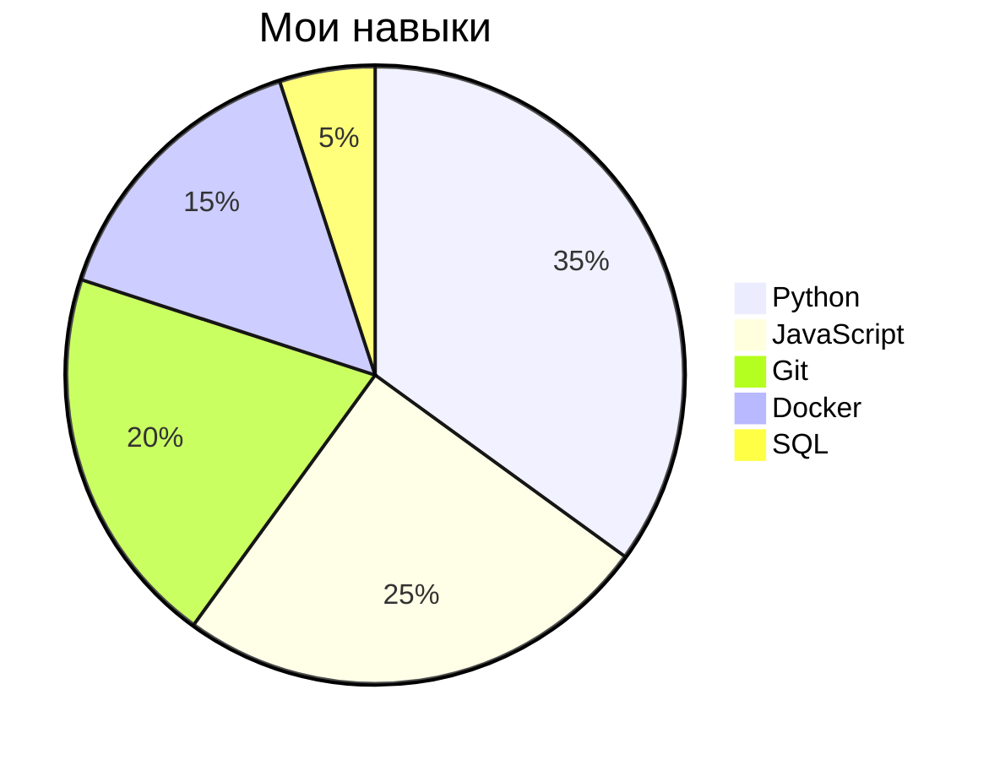

### 👋 Hey there, I'm Amirkhon!

🚀 Passionate about AI, engineering, and building innovative solutions.

---

### 💡 About Me
- 🎯 **Expertise**: AI, Machine Learning, Full-Stack Development
- 💼 **Currently Working On**: [Your Current Project]
- 📚 **Learning & Exploring**: [Technologies or Topics You're Learning]
- 🌍 **Open to Collaborations**: AI, Web Development, and Open Source
- 📫 **Contact Me**: [Your Email] | [LinkedIn Profile] | [Twitter Handle]

---

### 🛠 Tech Stack

---

### 📊 GitHub Stats

---

### 🔥 Fun Facts
- 🎮 I love gaming and exploring new AI advancements
- 📖 Constantly learning and improving my skills
- 🎨 Sometimes I design cool UI/UX concepts for fun

🚀 **Let's build something amazing together!**

## 🚀 Tech Stack

## 📈 GitHub Stats

## 🛠️ Projects

- **Project Name:** Brief description.
  - 
  - 

## 📫 Contact

